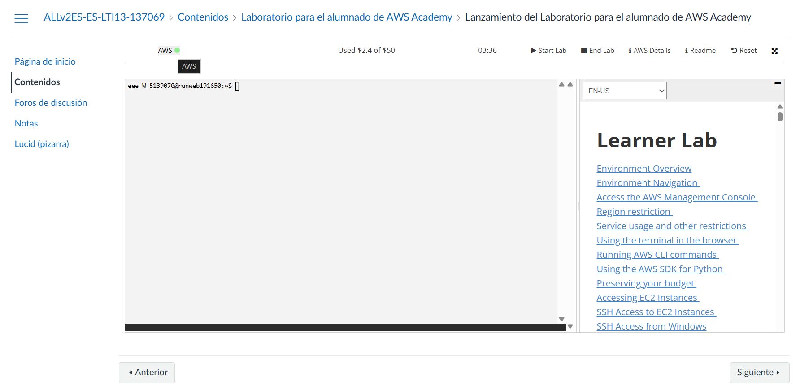
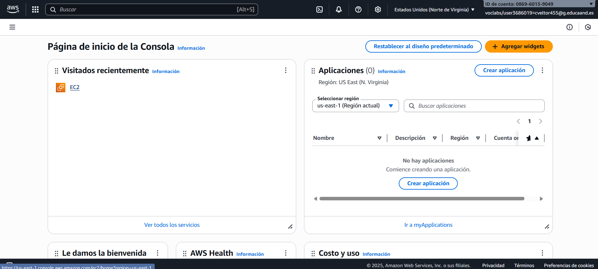
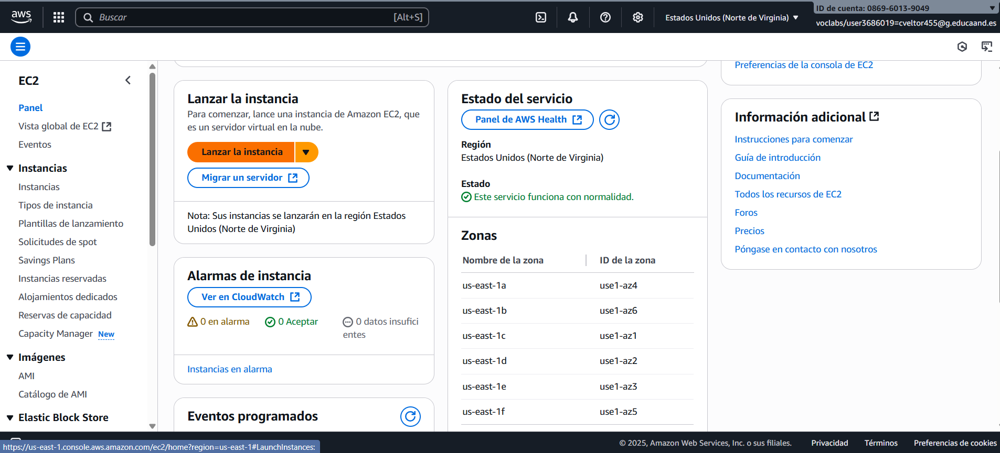
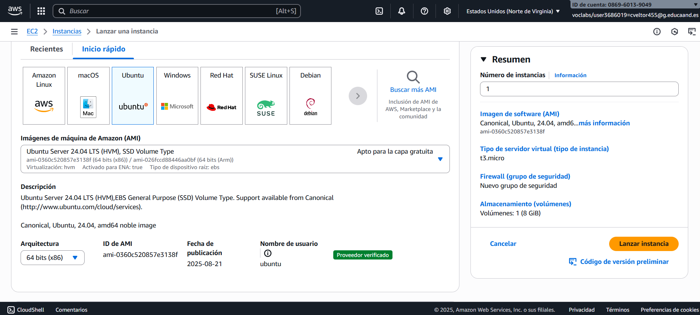
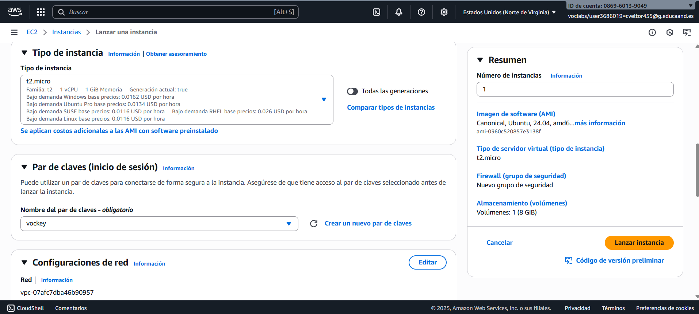
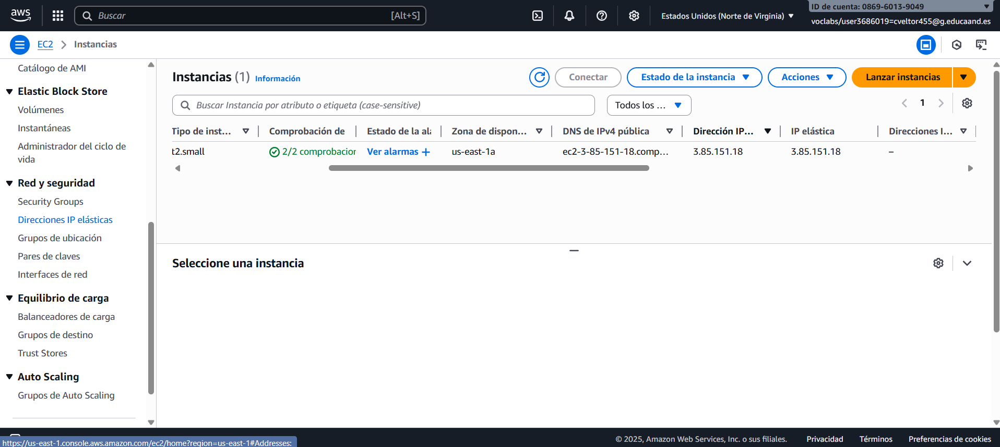
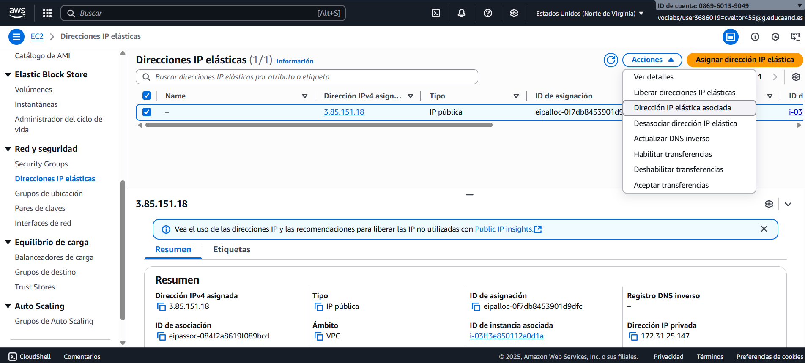
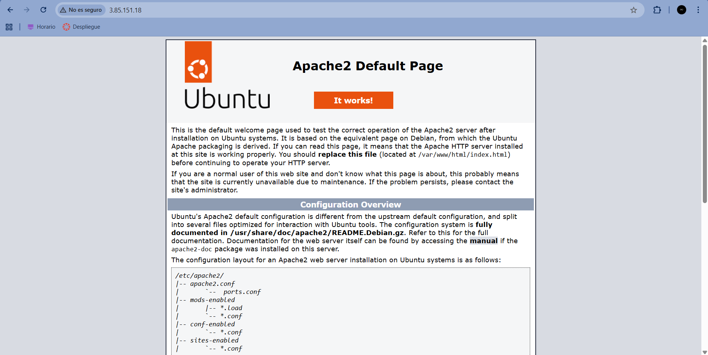

# Instalación de la pila LAMP en Ubuntu Server

Para realizar dicha instalación, realizaremos los siguientes pasos:

## 1. Creación de la instancia EC2

La instancia se creó a partir de una imagen de Ubuntu Server. El modelo elegido fue el **t2.micro**, con **2 GB de RAM** y **30 GB de disco**. Los puertos SSH, HTTP y HTTPS quedaron abiertos en el cortafuegos. Para el acceso SSH, se utilizó el par de claves **vockey.pem** de AWS. También le asignamos una IP elástica para que la dirección de la instancia permanezca fija a lo largo de nuestras pruebas.

### 1.1. Paso a paso

1. Se accedió a la consola de AWS EC2 y se seleccionó **Lanzar instancia**.

2. Se eligió la Community AMI de **Ubuntu Server**.

3. El tipo de instancia fue configurado como **t2.micro** y se creó o seleccionó un **par de claves** (ej.vockey.pem) para la conexión SSH..

### 1.2. Configuración de Red y Seguridad (Grupo de Seguridad)

Durante la configuración de la instancia, se creó un Grupo de Seguridad para actuar como firewall virtual. Este grupo de seguridad permite el tráfico entrante a través de los siguientes puertos TCP, esenciales para el proyecto:

### 1.3. Asignación de Dirección IP Elástica (EIP)

Dado que la IP pública dinámica de una instancia EC2 cambia al reiniciarse, se vinculó una dirección IP elástica (EIP) a nuestra máquina. Esto garantiza una dirección pública estática y persistente para las fases de prueba.

#### 1.3.1. Proceso:
1. En el panel de EC2, se seleccionó "IP elásticas".

2. La IP elástica se asoció a la instancia EC2 recién creada.

## 2. Instalación de la pila LAMP

El script **install_lamp.sh** automatiza los siguientes pasos: actualización del sistema, e instalación de Apache, MariaDB y PHP con las extensiones necesarias.

### 2.1. Sistema base: actualización

<u>Comandos Clave:</u> *sudo apt update* && *sudo apt upgrade -y*

Este es siempre el primer paso en cualquier sistema operativo basado en Debian/Ubuntu.

**sudo apt update** actualiza la lista de paquetes disponibles, consultando los repositorios en internet.

**sudo apt upgrade -y** instala las nuevas versiones de todos los paquetes ya instalados en el sistema. El flag **-y** (yes) acepta automáticamente todas las peticiones de instalación o actualización. Esto garantiza que el sistema operativo esté al día antes de instalar nuevo software.

### 2.2. Servidor Web: Apache

<u>Comando Clave:</u> *sudo apt install apache2 -y*

Este comando instala el servidor web Apache2. Apache es el software responsable de escuchar peticiones HTTP (p. ej., cuando alguien escribe tu dirección IP o dominio en su navegador) y servir los archivos de tu sitio web (HTML, CSS, imágenes, etc.) en respuesta.

### 2.3. Base de Datos: MariaDB

<u>Comandos Clave:</u> *sudo apt install mariadb-server -y*

MariaDB es un sistema de gestión de bases de datos relacionales (RDBMS), una bifurcación popular de MySQL. Este comando instala el servidor de bases de datos. Su función es almacenar, organizar y recuperar los datos de sitios dinámicos, como usuarios, publicaciones de blog o inventarios.

### 2.4. Lenguaje de Procesamiento: PHP

<u>Comandos Clave:</u> *sudo apt install php libapache2-mod-php php-mysql -y*

PHP es el lenguaje de programación del lado del servidor que permite la creación de contenido dinámico (p. ej., si tienes un WordPress, un foro o un carrito de compras).

**sudo apt install php** instala el intérprete principal de PHP.

**libapache2-mod-php** instala el módulo que integra PHP con Apache, permitiendo que el servidor web pase los archivos .php a este intérprete para su procesamiento.

**php-mysql** instala la extensión o módulo de PHP que le permite comunicarse y gestionar las bases de datos MariaDB/MySQL.

### 2.5. Comprobación de acceso a la IP elástica.

Si busco la IP elástica en mi navegador, podemos ver que funciona correctamente.

