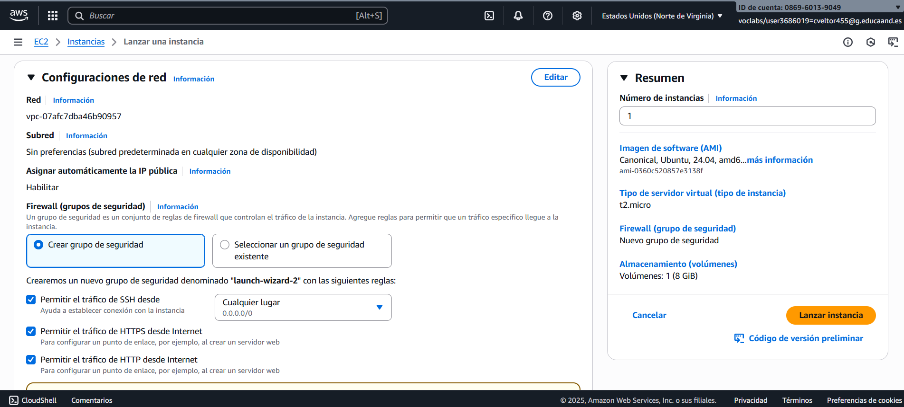

# Instalación de la pila LAMP en Ubuntu Server

Para realizar dicha instalación, realizaremos los siguientes pasos:

## 1. Creación de la instancia EC2

La instancia se creó a partir de una imagen de Ubuntu Server. El modelo elegido fue el **t2.micro**, con **2 GB de RAM** y **30 GB de disco**. Los puertos SSH, HTTP y HTTPS quedaron abiertos en el cortafuegos. Para el acceso SSH, se utilizó el par de claves **vockey.pem** de AWS. También le asignamos una IP elástica para que la dirección de la instancia permanezca fija a lo largo de nuestras pruebas.

### 1.1. Paso a paso

1. Se accedió a la consola de AWS EC2 y se seleccionó **Lanzar instancia**.

2. Se eligió la Community AMI de **Ubuntu Server**.

3. El tipo de instancia fue configurado como **t2.micro** y se creó o seleccionó un **par de claves** (ej.vockey.pem) para la conexión SSH..

### 1.2. Configuración de Red y Seguridad (Grupo de Seguridad)

Durante la configuración de la instancia, se creó un Grupo de Seguridad para actuar como firewall virtual. Este grupo de seguridad permite el tráfico entrante a través de los siguientes puertos TCP, esenciales para el proyecto:

### 1.3. Asignación de Dirección IP Elástica (EIP)

Dado que la IP pública dinámica de una instancia EC2 cambia al reiniciarse, se vinculó una dirección IP elástica (EIP) a nuestra máquina. Esto garantiza una dirección pública estática y persistente para las fases de prueba.

#### 1.3.1. Proceso:
1. En el panel de EC2, se seleccionó "IP elásticas".

2. La IP elástica se asoció a la instancia EC2 recién creada.
